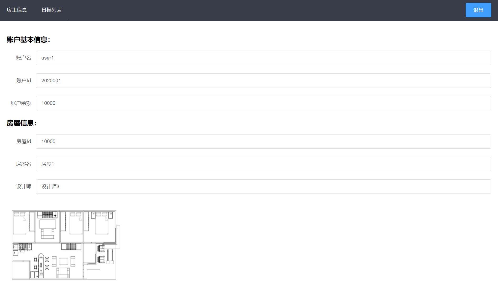
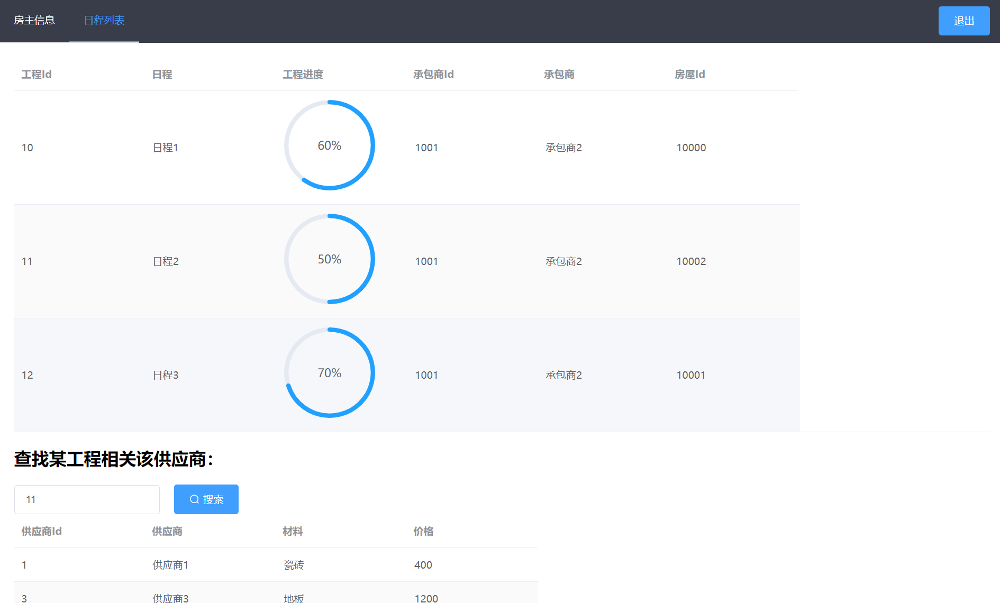
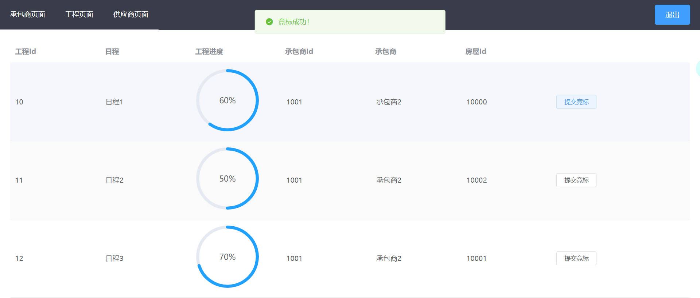
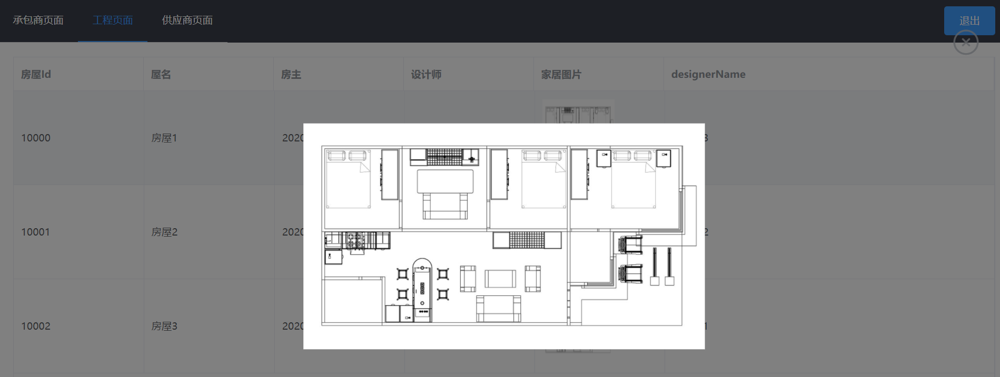
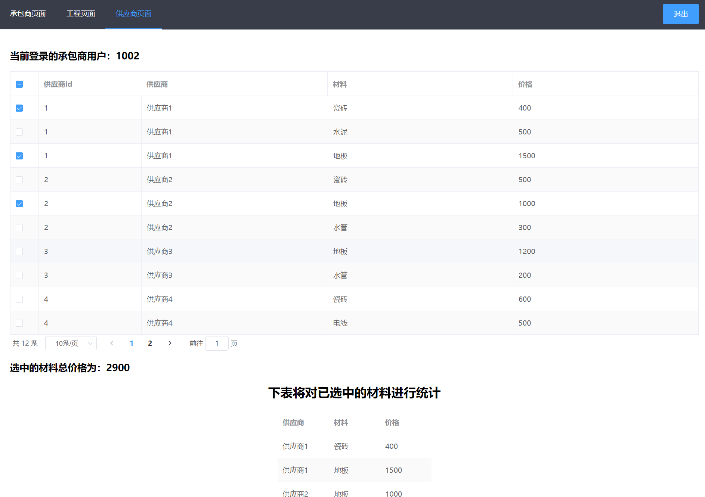

# database-design

## 说明

AHU数据库设计，家居系统，主要页面如下：

### 登录


### 房主





### 承包商







## Project setup

### 安装依赖

```
npm install
```

### 运行
```
npm run serve
```

### Compiles and minifies for production
```
npm run build
```

### Lints and fixes files
```
npm run lint
```


